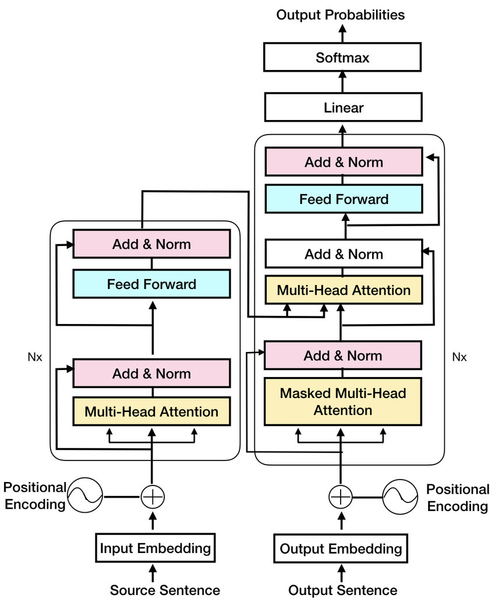

# Transformer Models

The Repo focuses on Transformer model used for Training and Inferencing the Multivariate timeseries prediction model. Give the Input series of Time signals, the model will train to predict the Output time series. 

Similar to Language translation from one language to other, This model is developed to create similar for Time series.
## Installation of required libraries
````
cd Time-series-Transformer
pip install -r requirements.txt
````

Required version of Python: Python 3.11.5
## Training the model
configure the metaData.json file for the input, output signals, Train data path and other hyperparameters
````
python train_model.py
````
once the model training is started a folder with current timestamp will be created and the model, Scaler files and other metadata will be saved in it

## Models
### Transformer Model architecture



